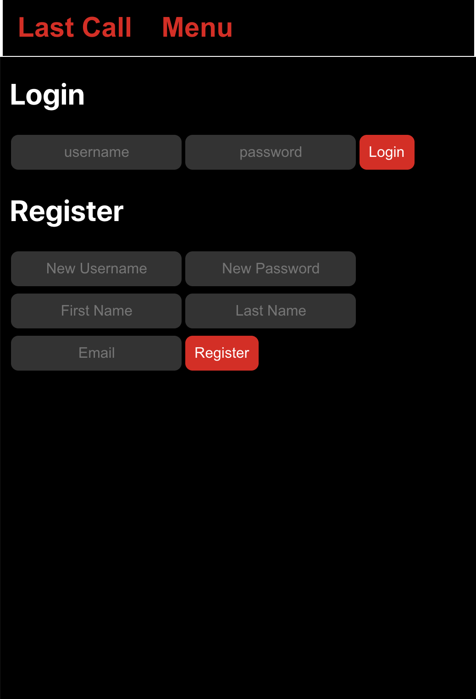
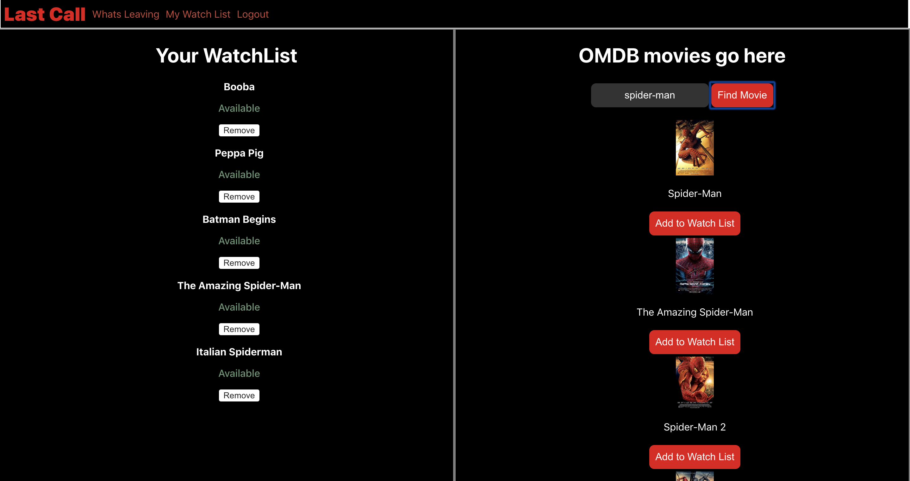
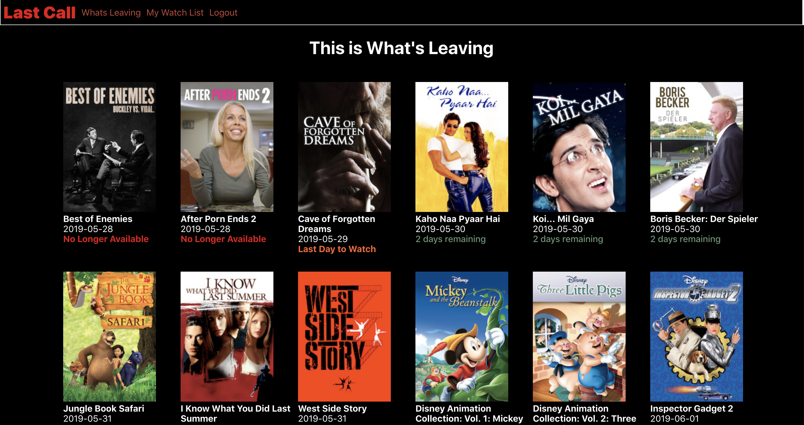
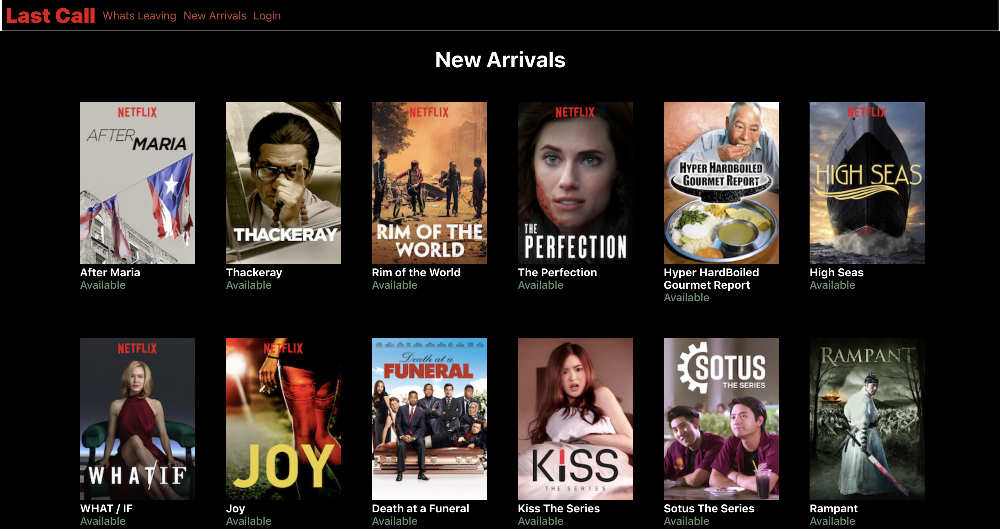

# LAST CALL 

**By Richard Lorenzini and Mike Starbuck**

~Hosted live on HEROKU.~

When installing locally, open a terminal in the client and server folders separately and run ```npm install && npm start``` in the client folder and ```npm install && nodemon app.js``` in the server folder.

**NOTE:** This application uses API keys which are hidden inside of .env.json files. Some of the API Keys have a cost associated with them, which is why we are not sharing them online. This means the application's features may not work as expected on your local machine. If you wish to get a free API Key and impliment it yourself, head on over to <a href="http://rapidapi.com">RapidAPI</a> and search for the UNOGS API.

A login has been created for demonstration purposes.

| USERNAME  | PASSWORD |
| :--- | :--- |
| Guest | Guest |

# About 

Netflix is a subscription based application which allows users to watch movies and shows for a monthly fee. The available content changes based on Netflix's ability to purchase and maintain the rights to said content. Netflix released a quarterly report on which movies and shows will be removed from their application, but there is not built-in service for users to see which movies and shows are being removed. 

With our application, users can create a watch list which is then compared to Netflix's upcoming content removal list. Users then see a countdown for how many days they have left before their movies or shows will no longer be available! 

# How It Works 

**Login** 
 
 

Our login page allows new users to register and login on one page. 

**Watch List** 

Once logged in, users can add movies to their personal watch list. When checked against the current content list, users will be notified if the movie or show is available or not.




Users can check the full list at any point, to see what will be leaving soon.



**New Releases Coming To Netflix**

Users are now able to see a list of upcoming movies and shows which will be available on Netflix soon!




